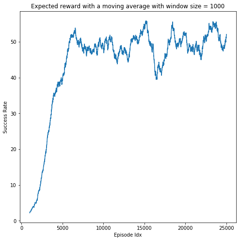

# Reinforcement Learning via Q-learning to play Frozen Lake

In this project, we train an agent to play Frozen Lake game. The game consists of a rectangular grid wherein some tiles of the grid are walkable, and others lead to the agent falling into the water. Additionally, the movement direction of the agent is uncertain and only partially depends on the chosen direction. The agent is rewarded for finding a walkable path to a goal tile. 

We consider 3 algorithms to operate the agent
* **Random Walk** approach: Here the agent randomly selects the direction he wants to go ignoring the holes. With this, the agent achieves a success rate of 1.4%
* **Assuming non-slippery conditions**: Here the agent assumes that the ice is not slippery and heads straight towards the goal (of course, avoiding all the holes and stepping in the direction of a grid which are walkable. However since the ice is slippery, it is not guaranteed that he will land in the tile he desires. The success rate of the agent that uses this algorithm was 4%
* **Q-Learning approach of Reinforcement Learning**: The agent is trained using Q-learning approach where a q_table is trained to maximize the reward in taking a particular action. The agent which performs action as per the q_table achieved using this process achieves a success rate of 75%!!

Below figure shows how the success rate improves as we train q_table over several agent attempts 

